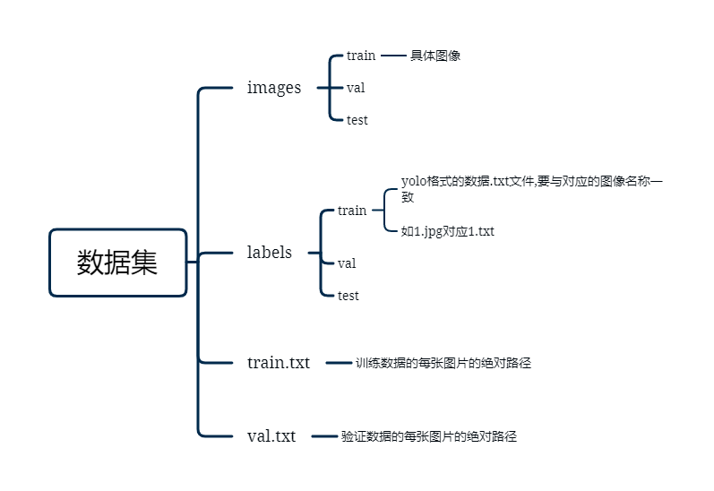
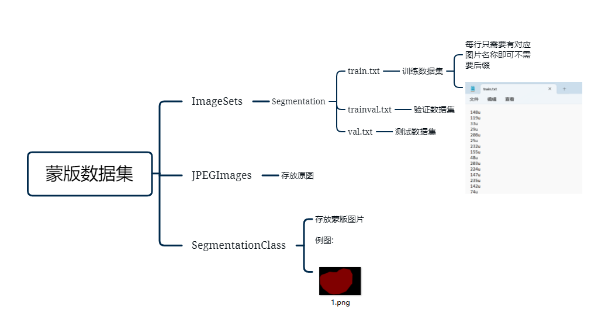
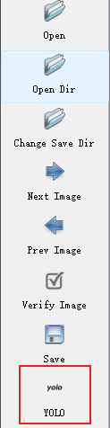
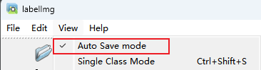
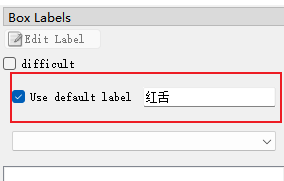
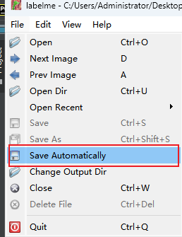
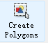

# 使用说明
这是本人的毕业设计，由于内容较多，已经上传到夸克网盘，复现较为复杂， 仅建议参考学习，测试数据已在设计思路.pdf中给出，网盘地址：https://pan.quark.cn/s/839bfd9529ab
## 一.准备数据集

### 1.1使用本项目的数据集

需要从网站上下载需要的数据集,本项目使用的数据集已经上传至该网站(https://aistudio.baidu.com/datasetdetail/257672)

### 1.2使用自己的数据集

需要准备一份yolo格式的数据集具体格式如下:

voc格式图像数据集:

### 1.3数据集标注:

#### 1.3.1制作yolo数据集时,推荐使用labelImg

在pycharm终端里输入:

`pip install labelImg`  

安装完成后,输入labelImg即可打开标注软件:

选择Open Dir打开到要标注的数据集路径

选择Change Save Dir打开要保存到的标签txt文件路径

要注意将标签格式改为yolo

选择Auto Save mode开启自动保存

在右上角可以设置默认标签值,这样框选完会自动打上对应标签,不需要确认,所以建议将同一类数据放在一起标注,不要将不同类型数据混在一起

按W键开启标注,在图中拖拽画框即可,按A,D键可快速切换图片

#### 1.3.2制作蒙版数据集时,推荐使用labelme

在pycharm终端里输入:

`pip install labelme=3.16.5`

安装完成后输入:labelme,打开软件

选择Open Dir打开到要标注的数据集路径

选择Save Automatically自动保存,标注好的数据集默认放在标注数据集同文件夹下

点击Create Polygons开始标注,沿着要框选的目标沿着边缘一次点击围成圈即可

点击Edit Polygons可以对已经圈好的框进行手动修正

按D可以快速切换到下一张

标注完成后将生成的所有json文件单独放在一个文件夹中

##### 找到labelme源文件

路径:Users\用户名\\.conda\envs\环境名\Lib\site-packages\labelme

找不到可以使用搜索软件Everything快速找到

然后找到`labelme\cli`的位置，先备份一下原来的json_to_dataset.py文件，然后用本项目中的同名文件复制到该路径下

修改一下该文件的路径,改成自己的json文件夹路径

将pycharm终端路径修改至cli文件夹下,使用以下命令

-o后面是你要输出结果的路径

`python .\json_to_dataset.py json_file_dir -o D:\dataset\output_mask\`

运行本项目中.py文件,即可获得蒙版图像

## 二.准备训练

### 2.1使用本项目的数据集训练:

使用yolov7时可以直接在pycharm终端使用以下命令,如果有6g显存batch-size为4即可,可以根据自己的显存慢慢调整,也可以修改epoch数量,减少训练时间

`python yolov7-main/train.py --weights yolov7-main/weights/yolov7_training.pt --cfg yolov7-main/cfg/training/yolov7-tongue.yaml --data yolov7-main/data/tongue.yaml --device 0 --batch-size 4 --epoch 200`

使用deeplabv3时可以直接在pycharm终端使用以下命令

`python pytorch-deeplab-xception-master/train.py --dataset tongue_mask --backbone mobilenet --lr 0.007 --workers 1 --epochs 300 --batch-size 8 --gpu-ids 0 --checkname deeplab-mobilenet`

### 2.2使用自己的数据集训练:

yolov7具体修改参照:

[YOLOv7（目标检测）入门教程详解---检测，推理，训练_yolo软件_螺丝工人的博客-CSDN博客](https://blog.csdn.net/weixin_64524066/article/details/126845366?ops_request_misc=%7B%22request%5Fid%22%3A%22167685328616782428675333%22%2C%22scm%22%3A%2220140713.130102334..%22%7D&request_id=167685328616782428675333&biz_id=0&utm_medium=distribute.pc_search_result.none-task-blog-2~all~top_positive~default-1-126845366-null-null.142^v73^control,201^v4^add_ask,239^v2^insert_chatgpt&utm_term=yolov7&spm=1018.2226.3001.4187)

deeplabv3+具体参照:

[pytorch从零开始用语义分割网络(deeplab3+)训练自己的数据集_deeplabv3+ pytorch_大黑山修道的博客-CSDN博客](https://blog.csdn.net/sazass/article/details/127262441?ops_request_misc=%7B%22request%5Fid%22%3A%22168031645616800186568965%22%2C%22scm%22%3A%2220140713.130102334..%22%7D&request_id=168031645616800186568965&biz_id=0&utm_medium=distribute.pc_search_result.none-task-blog-2~all~top_click~default-2-127262441-null-null.142^v80^wechat_v2,201^v4^add_ask,239^v2^insert_chatgpt&utm_term=deeplabv3训练自己数据集&spm=1018.2226.3001.4187)

## 三.参考资料
